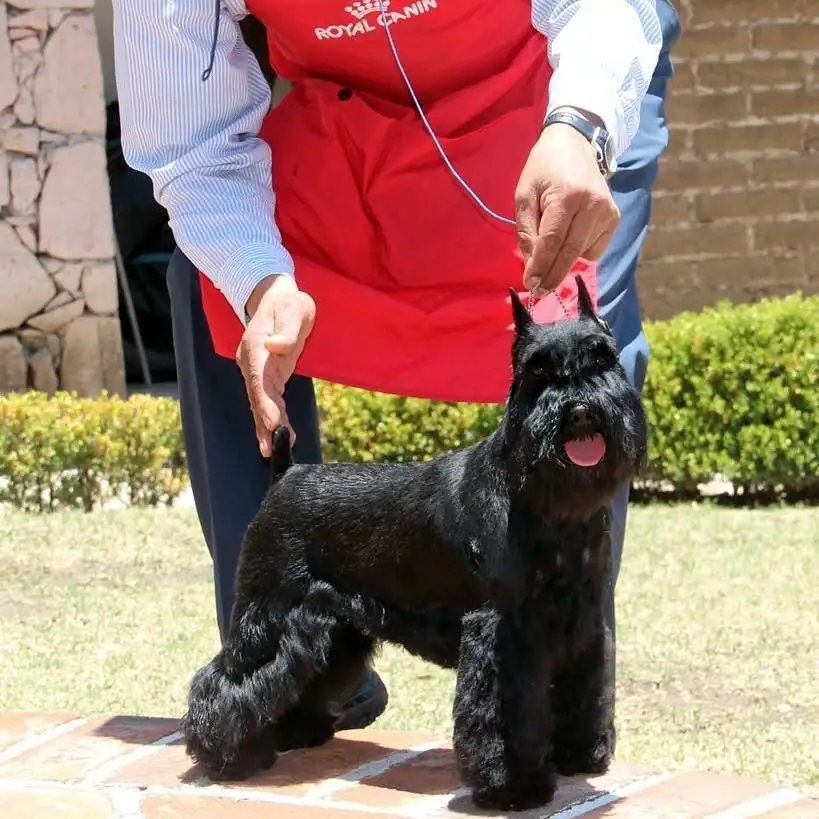
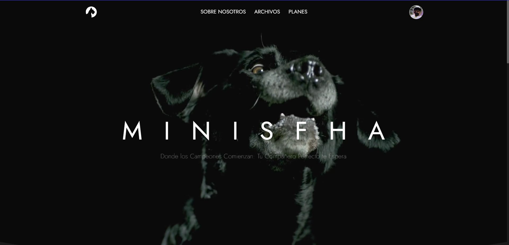
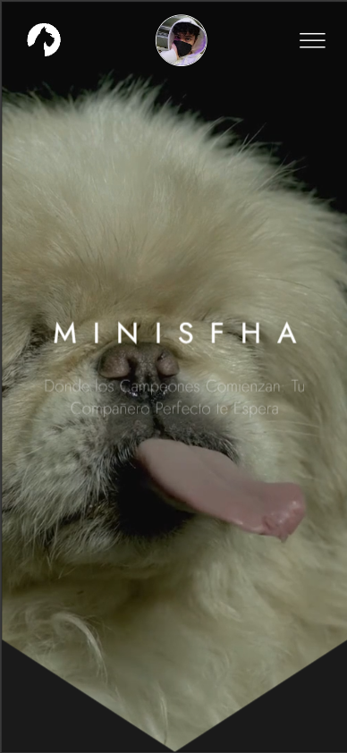

<a name="readme-top"></a>

<div align="center">

<a href="https://minis-fha.vercel.app/">
  
</a>

## Web oficial de Minis Fha

Minis Fha es un adiestrador de perros de muchos años de experiencia el cual ofrece sus servicios en Puebla.\
[Reportar error](https://github.com/V1CMA-V/minis-fha/issues) · [Sugerir algo](https://github.com/V1CMA-V/minis-fha/issues)

</div>

## Características principales

- **Detalles de los servicios**: Obtén información detallada sobre precios, beneficios y planes.
- **Suscripcion a los planes**: Permite a los usuarios dirigirlos a la inscripcion de sus mascotas a un plan.
- **Redes sociales**: Conoce las redes oficiales donde podrás informarte sobre el adiestramiento.

### Capturas de pantalla de la web de La Velada IV





<p align="right">(<a href="#readme-top">volver arriba</a>)</p>

## Para empezar

### Prerequisitos

- NVM (recomendado para asegurar versión de Node) ver [documentación oficial](https://github.com/nvm-sh/nvm?tab=readme-ov-file#installing-and-updating)

  ```sh
  nvm use
  # o
  nvm use <version>
  ```

  > Si quieres automatizar el proceso, puedes crear un script siguiendo la [documentación oficial](https://github.com/nvm-sh/nvm?tab=readme-ov-file#calling-nvm-use-automatically-in-a-directory-with-a-nvmrc-file)

<details>
	<summary>Pequeño script de automatización</summary>
	
- En Linux/MacOS:
	```sh
	# .bashrc | .zshrc | cualquier archivo de configuración
	# pequeño script para cambiar de version al entrar al directorio
	cd() {
  builtin cd "$@"
		if [[ -f .nvmrc ]]; then
			nvm use > /dev/null
			# Si quieres que te diga la versión
			nvm use
		fi
	}
	```

- En Windows:

  ```powershell
  # $PROFILE
  function Change-Node-Version {
  	param($path)
  	& Set-Location $path
  	$pwd = pwd
  	if ( Test-Path "$pwd\\.nvmrc" ) {
  		$version = Get-Content .nvmrc
  		nvm use $version
  	}
  }
  New-Alias -Name cd -Value Change-Node-Version -Force -Option AllScope
  ```

  </details>

- PNPM (es nuestra recomendación por su eficiencia y rapidez)

  ```sh
  npm install -g pnpm
  ```

- o NPM

  ```sh
  npm install npm@latest -g
  ```

### Instalación

1. Clona el repositorio

   ```sh
   git clone https://github.com/V1CMA-V/minis-fha.git
   ```

2. Instala los paquetes de NPM

   ```sh
   pnpm install
   ```

3. Ejecuta el proyecto
	 - Base de datos remota (necesario linkear con proyecto de Astro Studio)
   ```sh
   pnpm run dev
   ```
   - Base de datos local
   ```sh
   pnpm run start
   ```

4. Autenticación mediante google (opcional)
   - Accede a la [consola de google](https://console.cloud.google.com/apis/credentials?hl=es-419&pli=1&project=minis-fha), crea un proyecto y obtén tu client id y client secret
   - Genera un hash aleatorio, puedes usar el siguiente comando ```openssl rand -hex 32```
   - Crea un archivo llamado ```.env.local``` y copia el contenido de [.env.demo](.env.demo) en él
   - Reemplaza el texto copiado de demo en ```.env.local``` con tu id, secreto y hash

<p align="right">(<a href="#readme-top">volver arriba</a>)</p>

## 🛠️ Stack

- [![Astro][astro-badge]][astro-url] - The web framework for content-driven websites.
- [![Typescript][typescript-badge]][typescript-url] - JavaScript with syntax for types.
- [![Tailwind CSS][tailwind-badge]][tailwind-url] - A utility-first CSS framework for rapidly building custom designs.
- [![@midudev/tailwind-animations][animations-badge]][animations-url] - Easy peasy animations for your Tailwind project.

<p align="right">(<a href="#readme-top">volver arriba</a>)</p>

[astro-url]: https://astro.build/
[typescript-url]: https://www.typescriptlang.org/
[tailwind-url]: https://tailwindcss.com/
[animations-url]: https://tailwindcss-animations.vercel.app/
[astro-badge]: https://img.shields.io/badge/Astro-fff?style=for-the-badge&logo=astro&logoColor=bd303a&color=352563
[typescript-badge]: https://img.shields.io/badge/Typescript-007ACC?style=for-the-badge&logo=typescript&logoColor=white&color=blue
[tailwind-badge]: https://img.shields.io/badge/Tailwind-ffffff?style=for-the-badge&logo=tailwindcss&logoColor=38bdf8
[animations-badge]: https://img.shields.io/badge/@midudev/tailwind-animations-ff69b4?style=for-the-badge&logo=node.js&logoColor=white&color=blue
[contributors-shield]: https://img.shields.io/github/contributors/midudev/la-velada-web-oficial.svg?style=for-the-badge
[contributors-url]: https://github.com/midudev/la-velada-web-oficial/graphs/contributors
[forks-shield]: https://img.shields.io/github/forks/midudev/la-velada-web-oficial.svg?style=for-the-badge
[forks-url]: https://github.com/midudev/la-velada-web-oficial/network/members
[stars-shield]: https://img.shields.io/github/stars/midudev/la-velada-web-oficial.svg?style=for-the-badge
[stars-url]: https://github.com/midudev/la-velada-web-oficial/stargazers
[issues-shield]: https://img.shields.io/github/issues/midudev/la-velada-web-oficial.svg?style=for-the-badge
[issues-url]: https://github.com/midudev/la-velada-web-oficial/issues